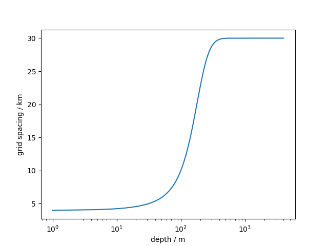

# some notes for gjs versions

# Global

## global landmask
The program `create_gshhs_nc.py` creates a mask based on GSHHS input file using `pygmt` to rasterize the shapefiles. 
PyGMT is available at (https://www.pygmt.org/dev/index.html).

## spacing
Currently I am using a tanh spacing function 

